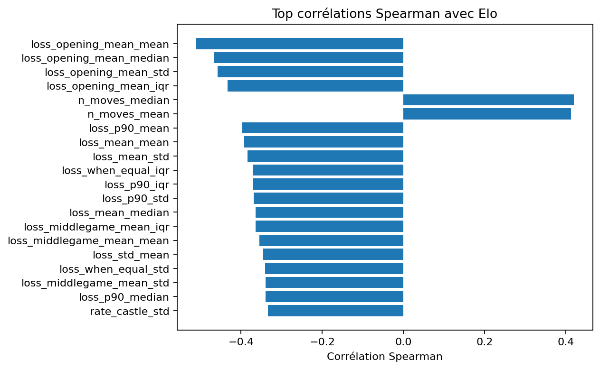
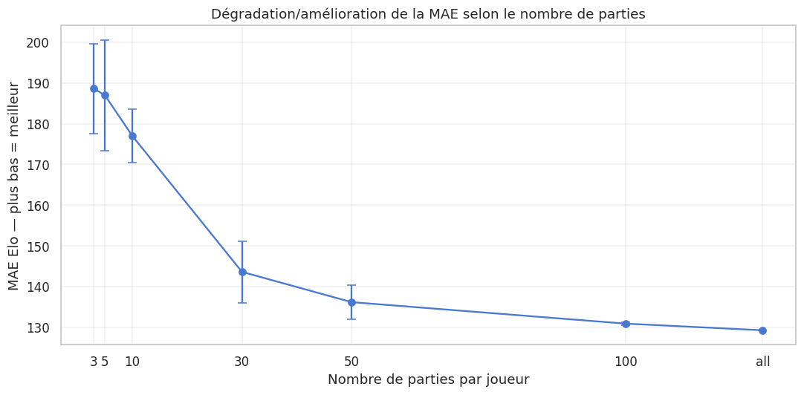

# PMind: Chess Elo Prediction & Behavioral Player Profiling

**Can we tell how strong a chess player is, and *how* they play, from just a few of their games?**

Modern chess engines are far stronger than humans, and simply weakening them doesn't make them play like humans. An **adaptive, human-like engine** first needs to know its opponent: their level and their style. This project models a player from their Lichess games in two steps:

1. **Estimate the player's Elo** from a small number of games (few-shot);
2. **Describe their playing style** with interpretable behavioral profiles, corrected for their predicted level.

> 🎓 M1 MIND research project, Sorbonne Université, May 2026
> Team: **Wafaa Berrais** & **Zineddine Mohammedi**
> Supervisors: **Nicolas Baskiotis** (in memoriam) & **Olivier Schwander**
> Full report (French): [`docs/report_fr.pdf`](docs/report_fr.pdf) · Slides: [`docs/presentation.pptx`](docs/presentation.pptx)

---

## Data

Games were collected through the **Lichess API**. We kept only rated, already analysed games with engine evaluations, per-move clocks and opening information. Players were sampled across five Elo buckets from 1000 to 2200, and a player was kept only if exactly 30 valid games were available in the target time control:

| Time control | Players | Games | Half-moves | Mean Elo |
|---|---:|---:|---:|---:|
| Bullet | 700 | 21,000 | 1,282,007 | 1682 |
| Blitz | 700 | 21,000 | 1,414,049 | 1672 |
| Rapid | 486 | 14,580 | 984,913 | 1583 |
| **Total** | **1,886** | **56,580** | **3,680,969** | |

<p align="center">
  
</p>

Each time control is stored at three levels (`moves.csv`, `games.csv`, `players.csv`). The collection code is in [`data_collection/`](data_collection/). The final dataset isn't included in this repository.

## Feature engineering

Moves are aggregated hierarchically (**move → game → player**) into about **215 interpretable features** per player and time control:

- **Move quality:** centipawn loss (cleaned), inaccuracy, mistake and blunder rates;
- **Time management:** time per move, zero-time moves, behaviour under time pressure;
- **Error context:** errors in winning, equal or losing positions;
- **Game phases:** opening, middlegame and endgame accuracy, and the gap between phases;
- **Style:** tactical activity, aggressiveness, simplification, game length, opening diversity;
- **Stability:** dispersion across games (std, IQR), with medians used in the few-game setting.

Elo-derived and result-derived variables were audited for **leakage** and removed.

<p align="center">
  
</p>

## Elo prediction

**Protocol:** a player-level train/validation/test split (64/16/20), stratified by Elo bucket, and evaluated for **N = 3, 5, 10 and 30 games per player** with repeated random draws. The main metric is **MAE in Elo points**.

| Experiment | Idea | Best result |
|---|---|---|
| **1. Global baseline** (1,000 players × 100 games) | CatBoost, XGBoost, Ridge, then an out-of-fold blend and **stacking** | **MAE 100**, R² 0.84 |
| **2. Per time control, N = 10** | Separate models for bullet, blitz and rapid; 4 feature-selection strategies (A–D) | MAE 152–176 (LightGBM/XGBoost); pruning negative features helps blitz |
| **3. Neural embeddings, N = 10** | DeepSets / attention "player fingerprints" from move sequences, fed to LightGBM | **Rapid MAE 137**, blitz 160, bullet 174 |
| **4. Game-level prediction + late aggregation, N = 10** | Predict Elo per game, aggregate (mean, median, log-weighted), then calibrate | Calibration cuts MAE by 20–35 points; blitz with move embeddings reaches **MAE 151** |

<p align="center">
  
  <br/><em>Error grows as fewer games are available: the few-shot setting is the real challenge.</em>
</p>

**Takeaways:** gradient boosting is the best fit for these heterogeneous tabular features. Separating time controls matters, because time features dominate in bullet and blitz while move quality matters more in rapid. Neural embeddings complement the hand-crafted features but don't replace them.

## Behavioral profiles

Two players with the same Elo can play very differently. We built **7 style scores**, **normalised against players of similar predicted Elo** (tempo, tactical aggressiveness, error risk, time pressure, endgame fragility, instability, poor conversion). We then assigned **semantic profiles** such as *fragile in the endgame*, *struggles under time pressure*, *aggressive*, *calm/positional*, *converts poorly* or *steady*.

| Time control | Profiles | Players in an interpretable profile | Tag alignment | Stability | η² with Elo |
|---|---:|---:|---:|---:|---:|
| Bullet | 23 | 98.3% | 0.94 | 0.72 | 0.038 |
| Blitz | 22 | 97.7% | 0.93 | 0.72 | 0.043 |
| Rapid | 19 | 97.7% | 0.95 | 0.76 | 0.051 |

*30 games per player; the results with 10 games are very close.* A cohesion ratio below 1 means players in the same profile are closer to each other than to random players. The very low **η² with Elo** shows that the profiles capture **style, not level**.

## Repository structure

```text
.
├── data_collection/                # Lichess API scraping (berserk) + cleaning, token setup
├── notebooks/
│   ├── 00_eda.ipynb                              # Elo distribution, time controls, move quality, correlations, few-shot stability
│   ├── 01_feature_pipeline_baseline.ipynb        # Experiment 1: hierarchical feature engineering
│   ├── 01b_stacking.ipynb                        # Experiment 1: CatBoost / XGBoost / Ridge stacking
│   ├── 02_per_time_control.ipynb                 # Experiment 2: per time control, N = 10
│   ├── 02b_feature_selection_abcd.ipynb          # Experiment 2: feature-selection strategies A–D
│   ├── 03_embeddings_deepsets_attention_a.ipynb  # Experiment 3: DeepSets / attention fingerprints
│   ├── 03b_embeddings_deepsets_attention_b.ipynb
│   ├── 04_game_level_aggregation.ipynb           # Experiment 4: game-level prediction + calibration
│   ├── 04b_game_level_with_embeddings.ipynb
│   └── 05_behavioral_profiles.ipynb              # Semantic profiles: quality metrics and examples
├── docs/
│   ├── report_fr.pdf               # full report (French, 70 pages)
│   ├── presentation.pptx
│   └── figures/
└── requirements.txt
```

Notes:
- The notebooks were run on **Google Colab** and read the data from Google Drive. Update the paths in their first cells to run them elsewhere.
- Their comments are in French.
- Lichess usernames shown in the notebook outputs have been **anonymised** (`player_001`, …).
- Move evaluations come from Lichess's server-side Stockfish analysis. Stockfish itself isn't needed to run the notebooks ([download it here](https://stockfishchess.org/download/) if you want to re-analyse games).

## Tech stack

Python · pandas · NumPy · scikit-learn · LightGBM · XGBoost · CatBoost · Optuna · PyTorch (DeepSets / attention) · python-chess · berserk (Lichess API) · Matplotlib / Seaborn · Google Colab

## References

- McIlroy-Young et al. *Aligning Superhuman AI with Human Behavior: Chess as a Model System* (Maia). KDD 2020.
- McIlroy-Young et al. *Learning Models of Individual Behavior in Chess*. KDD 2022.
- [Lichess API](https://lichess.org/api) · [Stockfish](https://stockfishchess.org/)
